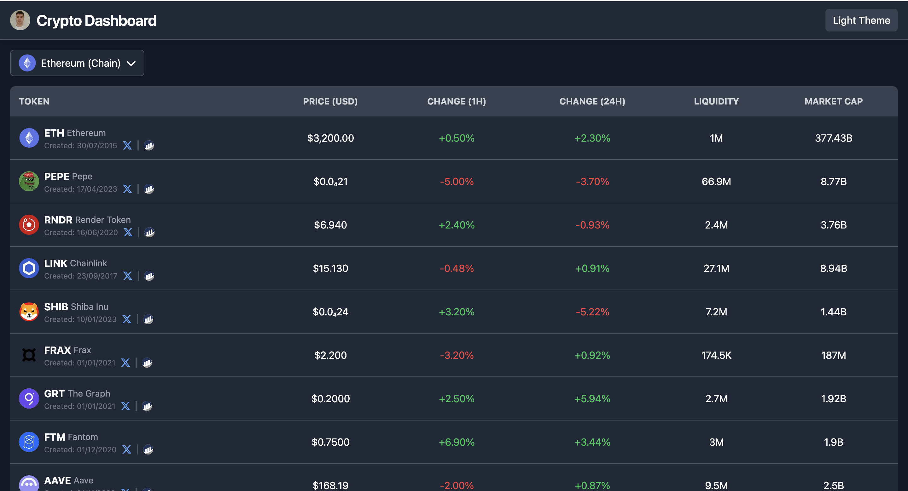
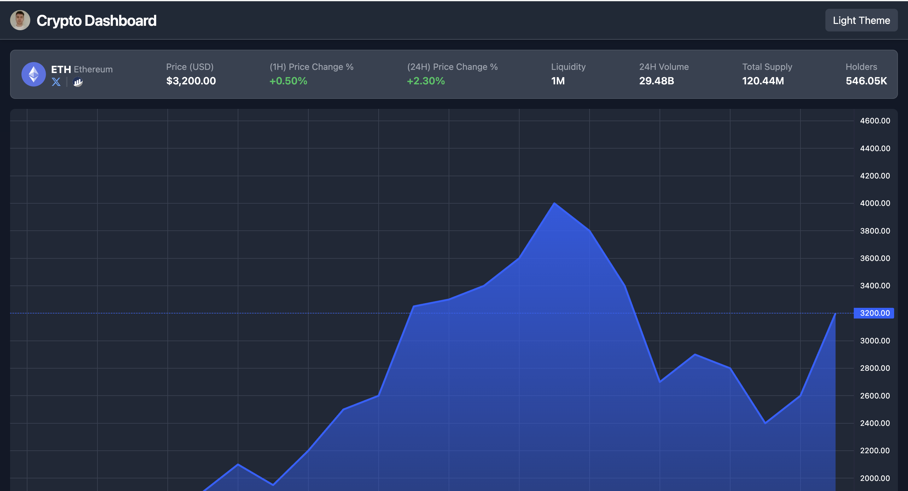

# **Crypto Dashboard**

A modern crypto dashboard built with **Next.js**, **Tailwind CSS**, and **TypeScript**. This application showcases token data, price changes, and dynamic charts using static data to simulate real-world scenarios.

## 🚀 **Live Demo**  
Check out the live version of the app hosted on [Vercel](https://crypto-dashboard-psi-two.vercel.app/).

---

## 🛠️ **Features**

- 📊 **Dynamic Token Table**: Displays token names, prices, symbols, and 24-hour/1-hour price changes.  
- 📈 **Interactive Charts**: Visual representation of token trends (static demo data).  
- 🌐 **Social Links**: External links to token-related platforms (e.g., Twitter, Etherscan).  
- 🎨 **Modern Design**: Responsive UI with dark mode support.  
- ⚡ **Fast and Optimized**: Built with Next.js for performance and SEO optimization.  

---

## 🖼️ **Screenshots**  

### **Main Dashboard**  


### **Token Details Page**  


---

## 🔧 **Technologies Used**

- **Next.js**: React framework used for simplified routing and project structure.  
- **Tailwind CSS**: Utility-first CSS framework for styling.  
- **TypeScript**: Static typing for improved code quality.  
- **lightweight-charts**: For creating dynamic charts.  
- **Vercel**: Hosting and deployment platform.

---

## 📂 **Project Structure**

```plaintext
├── components/         # Reusable components (e.g., table, chart)
├── pages/              # Pages and routing for the application
├── data/               # Static token and chart data
├── types/              # TypeScript types for tokens, charts, etc.
├── styles/             # Global CSS (global styles in global.css)
├── public/             # Static assets (e.g., images, fonts)
├── providers/          # React context providers using createContext
├── fonts/              # Custom font configurations
└── README.md           # Project documentation
```

---

## 🚀 **Getting Started**

### **Prerequisites**
Make sure you have **Node.js** and **npm/yarn** installed.

### **Installation**
1. Clone the repository:  
   ```bash
   git clone https://github.com/ndim99/CryptoDashboard
   cd crypto-dashboard
   ```

2. Install dependencies:  
   ```bash
   npm install
   # or
   yarn install
   ```

### **Development Server**
Start the development server:  
```bash
npm run dev
# or
yarn dev
```

Visit [http://localhost:3000](http://localhost:3000) in your browser to view the application.

### **Build for Production**
To create a production build:  
```bash
npm run build
npm run start
```

---

## 📄 **Static Data**

This project uses static data stored in TypeScript files located in the /data directory to simulate token data and chart information. You can update these files to test different scenarios.

---

## 📚 **Learn More**

To learn more about the tools and frameworks used in this project, check out:  
- [Next.js Documentation](https://nextjs.org/docs)  
- [Tailwind CSS Documentation](https://tailwindcss.com/docs)  
- [Lightweight Charts Documentation](https://tradingview.github.io/lightweight-charts/)  

---

## 📤 **Deploying on Vercel**

To deploy this project on Vercel:  
1. Push your repository to GitHub.  
2. Link the repository to [Vercel](https://vercel.com/).  
3. Configure the build settings (`npm run build`).  
4. Deploy the project.

---

## 💡 **Future Enhancements**

- Add live API data integration for tokens and charts.  
- Implement user authentication for personalized dashboards.  
- Include search and filter functionality for the token table.

---

## 🧑‍💻 **Author**

Developed by [Nikola](https://github.com/ndim99).

---